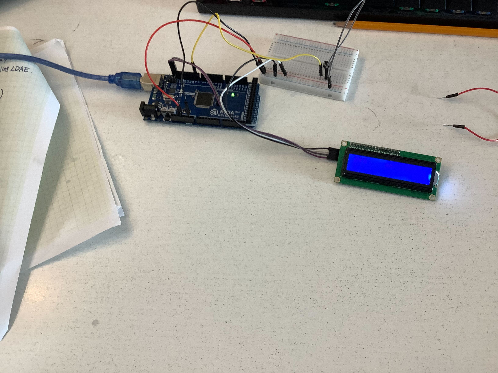

# Arduino_reaction_test
This is a arudino reaction test.
It blinks 5 times then everything goes blank and then you click a button and then it displays your time
this is the video: https://youtube.com/watch?v=E0ZlrXXfNjU

](https://www.youtube.com/watch?v=E0ZlrXXfNjU))

